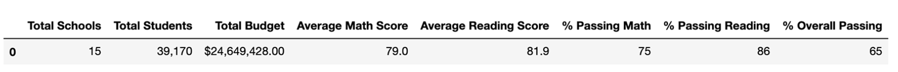

# School-District-Analysis
## Overview of Analysis
This analysis was done using standardized test data from a city school district for analysis, reporting, and presentations. This analysis will be used to gain insight on performance trends and patterns. 

The data will need to be cleaned due to evidence of academic dishonesty in the test results of the ninth-grade class at Thomas High School. These scores will be replaced with NaN values to uphold state-testing standards.

## Purpose
The purpose of this analysis is to aggregate data to showcase trends in school performance which will assist the school board and superintendent in making decisions regarding school budgets and priorities. 

## Results
-  The academic dishonesty had a low impact on the distric summary. After excluding the test scores from the Thomas High School ninth grade, there was a slightly lower passing percentage in both math and reading scores, which resulted in a difference in overall passing by 0.3 percent.

**Original District Summary**

**Adjested District Summary**

- Overall the School summary was also not greatly affected by the academic dishonesty. Thomas high school still has the second highest passing percentage of the 15 high schools included in the analysis. Thomas High School's standing in math compared to the other schools did not change, however the math passing percentage did drop slightly. Replacing the 9th grade scores at Thomas High School did cause the school to drop for the highest performing in reading to the third highest. 

**Original School Summary**

**Adjested School Summary**

  
- Effects of replacing the ninth-grade scores:
  - Since the scores were replaced with NaNs the scores cannot be compared to the other 9th grade classes. no other grades were affected by this change.
  - There was no effect to scores by school spending due to replacing the ninth-grade scores
  - There was no effect to scores by school size due to replacing the ninth-grade scores
  - There was no effect to scores by school type due to replacing the ninth-grade scores

## Summary
Replacing the scores for the ninth-grade class at Thomas High School did create some changes to the school district analysis. Thomas High School's passing math percentage was reduced as well as the average math score. A reduction was also seen in passing reading percentage. However, there was a slight increase in in the average reading score. Overall, replacing the scores resulted in a decrease of the school's overall passing percentage.